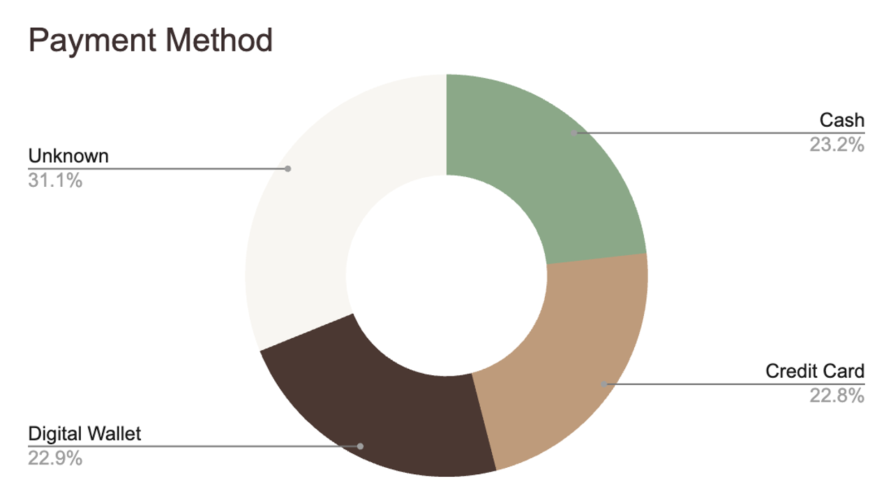
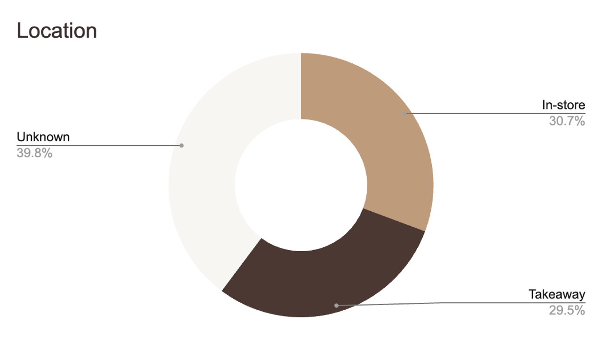

# Cafe Sales Performance & Customer Behaviour Analysis

> Capstone Project | Newton School of Technology  
> Faculty Mentor: Archit Raj | Group 16

---

## Table of Contents

- [Project Overview](#project-overview)
- [Team](#team)
- [Problem Statement](#problem-statement)
- [Dataset](#dataset)
- [Data Cleaning & Preparation](#data-cleaning--preparation)
- [KPI Framework](#kpi-framework)
- [Key Insights](#key-insights)
- [Recommendations](#recommendations)
- [Advanced Analysis](#advanced-analysis)
- [Dashboard](#dashboard)
- [Limitations](#limitations)
- [Future Scope](#future-scope)
- [Conclusion](#conclusion)

---

## Project Overview

This project analyzes café sales transaction data to uncover revenue drivers, customer behaviour patterns, and operational improvement opportunities. Using Google Sheets as the primary analytical tool, the team built a full analytics pipeline — from raw data cleaning to an interactive dashboard — demonstrating how small cafés can leverage simple tools to make data-driven decisions.

---

## Team

| Name               | Student ID | Role               |
| :----------------- | :--------- | :----------------- |
| Ananya Narang      | 2401020087 | PPT & Quality Lead |
| Divy Kumar Jain    | 2401010157 | Project Lead       |
| Hrishabh Prajapati | 2401020027 | Analysis Lead      |
| Preet Vardhan      | 2401010352 | Strategy Lead      |
| Rishik             | 2401010381 | Dashboard Lead     |
| Shubham Jain       | 2401010452 | Data Lead          |

---

## Problem Statement

The café lacked clarity on key business questions:

- What are the seasonal demand patterns?
- Which items drive the most revenue?
- How do customers prefer to pay and order?
- What is the split between in-store and takeaway orders?

This absence of analysis limited data-driven decisions across pricing, marketing, and operations.

**Objectives:**

1. Identify top-performing products by revenue and volume
2. Understand payment and channel usage patterns
3. Build an interactive dashboard for management decision-making

**Success Criteria:** Clear KPIs defined | 8 pivot analyses created | Actionable recommendations produced

---

## Dataset

- **Source:** [Cafe Sales – Dirty Data for Cleaning Training](https://www.kaggle.com) on Kaggle
- **Total Transactions:** 7,773
- **Product Categories:** 8
- **Time Span:** 12 months

### Schema

| Column         | Description                                   |
| :------------- | :-------------------------------------------- |
| Transaction ID | Unique identifier per transaction             |
| Month          | Month of transaction                          |
| Item           | Product purchased                             |
| Quantity       | Units sold                                    |
| Price Per Unit | Unit selling price                            |
| Total Spent    | Revenue per transaction                       |
| Location       | In-store / Takeaway / Unknown                 |
| Payment Method | Cash / Credit Card / Digital Wallet / Unknown |

### Data Quality Issues

| Field          | Missing / Unknown Rate |
| :------------- | :--------------------- |
| Location       | 39.78%                 |
| Payment Method | 31.12%                 |

> These gaps are treated as a business insight — poor POS data capture is an operational problem to solve.

---

## Data Cleaning & Preparation

All cleaning and transformation steps were executed in **Google Sheets**.

| Step            | Action Taken                                                     |
| :-------------- | :--------------------------------------------------------------- |
| Missing values  | Blank Location and Payment fields replaced with `"Unknown"`      |
| Sorting         | Created `Month Number` field for correct chronological ordering  |
| Standardization | Location normalized to 3 categories: In-store, Takeaway, Unknown |
| Outlier check   | Scanned for extreme/negative values — no major anomalies found   |

**Key Assumptions:**

- Unknown values represent missing entries, not a separate customer segment
- Item prices remained constant throughout the 12-month period

---

## KPI Framework

| KPI                       | Formula                        | Why It Matters                  |
| :------------------------ | :----------------------------- | :------------------------------ |
| Total Revenue             | `SUM(Total Spent)`             | Overall business performance    |
| Total Transactions        | `COUNT(Transaction ID)`        | Demand volume indicator         |
| Avg Order Value (AOV)     | `AVG(Total Spent)` ≈ $8.94     | Customer spending behaviour     |
| Total Quantity Sold       | `SUM(Quantity)`                | Menu and inventory optimization |
| Avg Items Per Transaction | `AVG(Quantity / Transactions)` | Real demand depth per visit     |

---

## Key Insights

1. Annual revenue totals approximately **$69,459**, with demand remaining stable across all 12 months.
2. **October and June** show marginally higher sales — mild seasonal peaks, not strong seasonality.
3. **Salad** is the highest revenue-generating item, making it the anchor product for profitability.
4. **Coffee and Juice** lead in transaction volume but yield lower revenue per unit.
5. **In-store** customers spend slightly more on average ($8.94) compared to Takeaway ($8.88).
6. Payment methods are evenly split across Cash, Credit Card, and Digital Wallet — no dominant preference.
7. **~40% of location records and ~31% of payment records are untracked** — a critical data capture failure.
8. Monthly demand is highly stable, ranging from 1,852 units (February) to 2,072 units (October).

---

## Recommendations

| Insight                  | Recommendation                                     | Estimated Impact          |
| :----------------------- | :------------------------------------------------- | :------------------------ |
| Salad leads revenue      | Promote premium and healthy combo offerings        | +8–12% revenue uplift     |
| In-store spend is higher | Improve seating, ambience, and dine-in experience  | +3–5% increase in AOV     |
| High missing data        | Fix POS tracking and enforce mandatory data fields | +25–30% decision accuracy |
| Peak months identified   | Run targeted campaigns in June and October         | +4–6% sales increase      |

---

## Advanced Analysis

**Demand Stability**

Monthly units sold range from 1,852 to 2,072 — a variation of only ~220 units over 12 months. This narrow band indicates consistent, predictable customer demand with no sharp seasonal disruption, which is favorable for inventory and staffing planning.

**Channel Spending Behaviour**

| Channel  | Average Order Value |
| :------- | :------------------ |
| In-store | $8.94               |
| Takeaway | $8.88               |

Although the difference is marginal, in-store customers present a greater upselling opportunity through staff interaction, combo suggestions, and ambience-driven extended visits.

---

## Dashboard

Built entirely in **Google Sheets** using pivot tables, formulas, and slicers.

**Interactive Filters:** Month | Item | Location | Payment Method

| View              | Description                                                 |
| :---------------- | :---------------------------------------------------------- |
| KPI Summary       | Total Revenue, Transactions, Quantity Sold, AOV at a glance |
| Monthly Trend     | Revenue performance across all 12 months                    |
| Product Analysis  | Revenue and volume comparison across 8 item categories      |
| Channel & Payment | Location split and payment method distribution              |

---

## 📊 Dashboard

**Payment Method**

**Location**

## Limitations

- High Unknown rate in Location (39.78%) and Payment Method (31.12%) restricts channel-level analysis
- No cost or margin data available — true profitability analysis was not possible
- No customer-level identifiers — repeat purchase behaviour and segmentation could not be performed
- External factors such as promotions, holidays, and price changes were not captured in the dataset
- Data accuracy is dependent on manual POS entry, which may contain recording errors

---

## Future Scope

- Incorporate cost and margin data to enable product-level profitability analysis
- Add customer identifiers to support segmentation and loyalty analysis
- Implement POS validation rules to eliminate missing location and payment entries
- Integrate promotion and pricing data to measure campaign ROI
- Apply time-series forecasting to predict sales and optimize inventory and staffing
- Migrate to a BI tool such as Power BI or Tableau for enhanced interactivity and scale

---

## Conclusion

This project demonstrates that simple spreadsheet analytics can generate meaningful, actionable business intelligence from raw transactional data. By applying structured analysis entirely within Google Sheets, the team identified revenue drivers, surfaced operational gaps, and produced a decision-ready dashboard — giving the café a clear, data-driven foundation for future business decisions.

---

_Submitted as part of the DVA Capstone 1 Project | Newton School of Technology_
